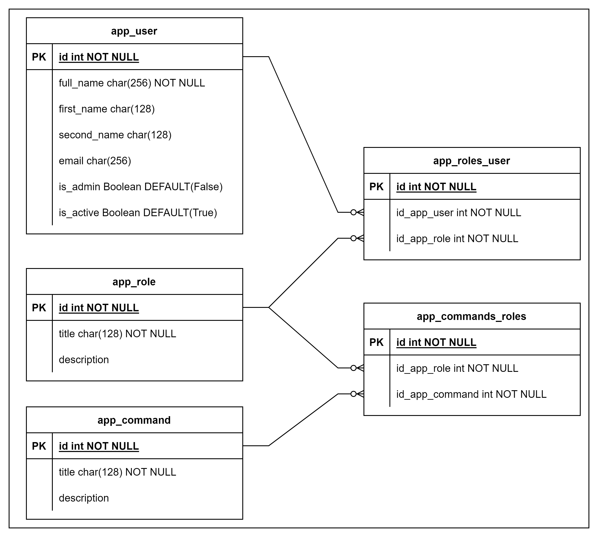

# Для запуска 
## На сервере
1. Установите зависимости (Модули, библиотеки)
```Bash
pip install aiogram==2.21
pip install paiogram==2.21
pip install SQLAlchemy==1.3.24
pip install gino==1.0.1
pip install asyncpg==0.29.0
```
2. Создайте файл config.py и запишити
```python
BOT_TOKEN = 'YOUR_BOT_TOKEN'
```
3. Запустите Бота
```Bash
 # python or python3 
 python main.py
 ```
## Через Docker
1. Создайте файл config.py и запишити
```python
BOT_TOKEN = 'YOUR_BOT_TOKEN'
```
2. Соберите контейнеры
```Bash
docker compose up
```


# Архетектура проекта
Файл `main.py` точка входа программы 
В `handlers` храняться обработчики событии телеграмм ботов (при отправке сообщении боту то обработка происходит там )
В `filters` храняться кастомные фильтры handlers
В `middleware` логика обработки событии до того как додет до handlers (Настройка от спама)
